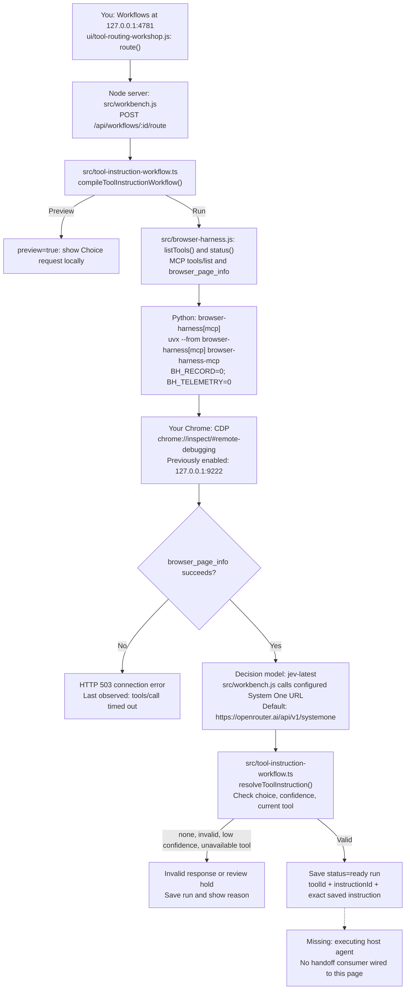

# Browser Harness route: code, agents, packages, and endpoints

This describes the implementation served from `C:\Users\jesse\.codex\worktrees\2563\jeview` at http://127.0.0.1:4781/. The root checkout `C:\sites\jeview` has different code. Source links below point to the running worktree.

| Piece | Code or package | Responsibility and address |
| --- | --- | --- |
| Workflow editor | [ui/tool-routing-workshop.js](C:/Users/jesse/.codex/worktrees/2563/jeview/ui/tool-routing-workshop.js) | You author routes/instructions, preview, run, and review. Viewer: [127.0.0.1:4781](http://127.0.0.1:4781/). |
| Local orchestrator | [src/workbench.js](C:/Users/jesse/.codex/worktrees/2563/jeview/src/workbench.js:334) | `POST /api/workflows/:id/route`; checks browser before/after Jev, saves run in SQLite. |
| Compiler and validator | [src/tool-instruction-workflow.ts](C:/Users/jesse/.codex/worktrees/2563/jeview/src/tool-instruction-workflow.ts:45) | `compileToolInstructionWorkflow()` offers available routes; `resolveToolInstruction()` returns the saved instruction or hold. |
| Browser bridge | [src/browser-harness.js](C:/Users/jesse/.codex/worktrees/2563/jeview/src/browser-harness.js:5) | `createBrowserHarness()` launches MCP; `listTools()`, `status()`, `call()` use JSON-RPC over stdio. Read URLs: `/api/browser/tools`, `/api/browser/status`. |
| Browser tool package | [browser-harness installation docs](https://github.com/browser-use/browser-harness/blob/main/install.md) | Python `browser-harness[mcp]`, launched with `uvx`. Chrome connection uses CDP. Bridge command does not explicitly pin Python 3.12 or a package version; recordings/telemetry are off. |
| Decision model | [src/jeview.ts endpoint default](C:/Users/jesse/.codex/worktrees/2563/jeview/src/jeview.ts:21) | `jev-latest` through configured System One endpoint, default `https://openrouter.ai/api/v1/systemone`. Built-in Node `fetch`; no Jev SDK imported here. |
| Canvas package | [scripts/workbench-libraries.mjs](C:/Users/jesse/.codex/worktrees/2563/jeview/scripts/workbench-libraries.mjs:10) and [React Flow docs](https://reactflow.dev/) | React and `@xyflow/react`, bundled into local `ui/vendor/workbench.js`; they draw/edit the graph. |
| Layout package | [package-lock.json](C:/Users/jesse/.codex/worktrees/2563/jeview/package-lock.json:42) and [Bootstrap Grid docs](https://getbootstrap.com/docs/5.3/layout/grid/) | Bootstrap Grid 5.3.8, served as `/_/ui/vendor/bootstrap-grid.min.css`; development dependency, no server runtime import. |
| Executing host agent | Unimplemented | Needs to consume the handoff, bind tool arguments, and call the bridge. The page saves/displays the handoff only. |
| Coding agent | Codex in this chat | Implements and verifies changes. The site's Jev route does not automatically dispatch work to Codex. |

Jev selects a route; local code supplies the exact saved instruction. Browser Harness supplies tools. `jev-ultrafast` is not imported in this route. `runToolInstructionWorkflow()` supports a host `deliver` callback, but the page endpoint uses the compiler/validator directly and never invokes this helper.

**Last browser observation, 30 September 2026:** discovery returned 23 definitions; `browser_page_info` timed out. This is not a new connection test. The live records API confirmed `openrouter.ai` as upstream host; the full URL in the chart is the source default, not a verified override. Installed Browser Harness version could not be refreshed because `uv tool list` could not access its tool lock.

Feedback is saved with `PUT /api/workflows/:id/route-runs/:runId/feedback`. You edit the route/instruction and rerun. Saving feedback does not automatically train Jev or rewrite instructions.

When this workflow changes, verify the affected code and behavior, update the chart and links, and show the revised Mermaid chart to the user.
