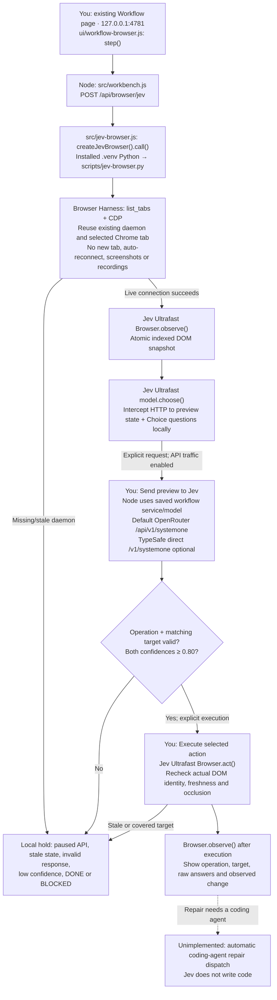
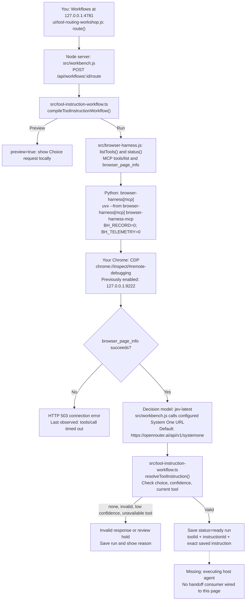

# Browser Harness and Jev in the existing Workflow editor

## Task list

- [x] Read current TypeSafe API, function-calling, parallel-questions and citation-check cookbooks.
- [x] Put the installed Ultrafast policy and Browser Harness executor behind controls in the existing Workflow inspector.
- [x] Group saved workflows by their execution purpose using cookbook categories. No empty recipe is advertised as a runnable saved workflow.
- [ ] Observe the editor, preview its actual state, obtain one native Jev operation/target choice and execute it in Chrome.
- [ ] Review the observed outcome against the goal; add the specific failed step to the next task.

The inspector displays the five browser steps as they progress. API pause and browser permission still gate live execution. No classifier answer or source check substitutes for a browser observation.

## Jev Ultrafast controls

The Workflow toolbar has a **Jev browser tools** icon. The same controls are under **View → Jev browser tools** and the inspector's **Browser** tab. The editor's graph stays in place.

| Piece | Actual code, package or URL |
| --- | --- |
| Inspector controls | [ui/workflow-browser.js](../ui/workflow-browser.js), opened by [ui/workflow-studio.js](../ui/workflow-studio.js). Observe, Preview, Send and Execute are separate steps. |
| Local endpoint | [src/workbench.js](../src/workbench.js): `POST /api/browser/jev`, commands `tabs`, `observe`, `preview`, `choose`, `execute`. Workflow ID binds the observation and preview; changing service/model requires another preview. |
| Persistent worker | [src/jev-browser.js](../src/jev-browser.js): `<JEV_ULTRAFAST_DIR>/.venv/Scripts/python.exe -u scripts/jev-browser.py <JEV_ULTRAFAST_DIR>` on Windows. Existing installation defaults to `C:/sites/jev-ultrafast`; override with `JEV_ULTRAFAST_DIR`. |
| Actual browser policy/executor | [scripts/jev-browser.py](../scripts/jev-browser.py) imports the installed [Jev Ultrafast `model.choose()` and `Browser`](https://github.com/browser-use/jev-ultrafast). The adapter attaches to an existing tab instead of the upstream demo's new tab. |
| Browser transport | Installed Browser Harness **0.1.13** in the existing Ultrafast environment. [Install and connection documentation](https://github.com/browser-use/browser-harness/blob/main/install.md). `browser-harness --doctor` diagnoses missing connections; this worker does not restart the daemon. |
| Model request | Node owns credentials and uses the existing traffic pause/ledger. [TypeSafe HTTP API](https://docs.typesafe.ai/api), [speculative fan-out](https://docs.typesafe.ai/patterns/fan-out). Operation and compatible target heads share one observed state, and only the matching target can execute. |
| Services | Configured gateway by default; `https://openrouter.ai/api/v1/systemone` or `https://api.typesafe.ai/v1/systemone` selected through the saved workflow. No direct Python model requests. |
| Text input | User supplies the text when Jev selects TYPE_TEXT. The adapter does not call an additional text model. |
| Recording and limits | Screenshots and Browser Harness recordings off. Execution history stays in worker memory; normal gateway request/answer records remain available. One step per user action, 20-action budget, 32,000-character preview budget, no automatic paid loop. DONE alone never confirms a repair. |

**Verification status, 30 September 2026:** the installed library imports and the JavaScript/Python syntax and Node typecheck pass. Codex's saved browser permission denies `http://127.0.0.1:4781`, so the restored inspector, Chrome observation, Jev decision and browser execution have **not been verified live**. No new Jev request was made for this change. The existing traffic pause is preserved.

## Earlier authored tool-routing integration

# Browser Harness route: code, agents, packages, and endpoints

This describes the implementation served from `C:\Users\jesse\.codex\worktrees\2563\jeview` at http://127.0.0.1:4781/. The root checkout `C:\sites\jeview` has different code. Source links below point to the running worktree.

| Piece | Code or package | Responsibility and address |
| --- | --- | --- |
| Workflow editor | [ui/tool-routing-workshop.js](C:/Users/jesse/.codex/worktrees/2563/jeview/ui/tool-routing-workshop.js) | You author routes/instructions, preview, run, and review. Viewer: [127.0.0.1:4781](http://127.0.0.1:4781/). |
| Local orchestrator | [src/workbench.js](C:/Users/jesse/.codex/worktrees/2563/jeview/src/workbench.js:334) | `POST /api/workflows/:id/route`; checks browser before/after Jev, saves run in SQLite. |
| Compiler and validator | [src/tool-instruction-workflow.ts](C:/Users/jesse/.codex/worktrees/2563/jeview/src/tool-instruction-workflow.ts:45) | `compileToolInstructionWorkflow()` offers available routes; `resolveToolInstruction()` returns the saved instruction or hold. |
| Browser bridge | [src/browser-harness.js](C:/Users/jesse/.codex/worktrees/2563/jeview/src/browser-harness.js:5) | `createBrowserHarness()` launches MCP; `listTools()`, `status()`, `call()` use JSON-RPC over stdio. Read URLs: `/api/browser/tools`, `/api/browser/status`. |
| Browser tool package | [browser-harness installation docs](https://github.com/browser-use/browser-harness/blob/main/install.md) | Python `browser-harness[mcp]`, launched with `uvx`. Chrome connection uses CDP. Bridge command does not explicitly pin Python 3.12 or a package version; recordings/telemetry are off. |
| Decision model | [src/jeview.ts endpoint default](C:/Users/jesse/.codex/worktrees/2563/jeview/src/jeview.ts:21) | `jev-latest` through configured System One endpoint, default `https://openrouter.ai/api/v1/systemone`. Built-in Node `fetch`; no Jev SDK imported here. |
| Canvas package | [scripts/workbench-libraries.mjs](C:/Users/jesse/.codex/worktrees/2563/jeview/scripts/workbench-libraries.mjs:10) and [React Flow docs](https://reactflow.dev/) | React and `@xyflow/react`, bundled into local `ui/vendor/workbench.js`; they draw/edit the graph. |
| Layout package | [package-lock.json](C:/Users/jesse/.codex/worktrees/2563/jeview/package-lock.json:42) and [Bootstrap Grid docs](https://getbootstrap.com/docs/5.3/layout/grid/) | Bootstrap Grid 5.3.8, served as `/_/ui/vendor/bootstrap-grid.min.css`; development dependency, no server runtime import. |
| Executing host agent | Unimplemented | Needs to consume the handoff, bind tool arguments, and call the bridge. The page saves/displays the handoff only. |
| Coding agent | Codex in this chat | Implements and verifies changes. The site's Jev route does not automatically dispatch work to Codex. |

Jev selects a route; local code supplies the exact saved instruction. Browser Harness supplies tools. `jev-ultrafast` is not imported in this route. `runToolInstructionWorkflow()` supports a host `deliver` callback, but the page endpoint uses the compiler/validator directly and never invokes this helper.

**Last browser observation, 30 September 2026:** discovery returned 23 definitions; `browser_page_info` timed out. This is not a new connection test. The live records API confirmed `openrouter.ai` as upstream host; the full URL in the chart is the source default, not a verified override. Installed Browser Harness version could not be refreshed because `uv tool list` could not access its tool lock.

Feedback is saved with `PUT /api/workflows/:id/route-runs/:runId/feedback`. You edit the route/instruction and rerun. Saving feedback does not automatically train Jev or rewrite instructions.

When this workflow changes, verify the affected code and behavior, update the chart and links, and show the revised Mermaid chart to the user.
