# Claim verification in the Workflow editor

The existing Workflow tab uses the approved canvas, icon toolbar, inspector and activity dock for gate graphs and ordered workflows. Tool routing retains its authored routes in the same visual shell. Saved agents, graph definitions, results and conversations stay in the existing local database; this change does not create another page.

## Actual execution

```mermaid
flowchart LR
  A["Local Codex JSONL<br/>scripts/sim/chatlog.js → toEvents"] --> B["src/workbench.js → turnsFor<br/>GET /api/history/turns"]
  B --> C["ui/workflow-studio.js → conversation<br/>Show recorded answer; choose verbatim claim"]
  C --> D["src/verification.js → verificationPacket<br/>Local passage retrieval + exact quote check"]
  D --> E["src/workbench.js → runOne<br/>POST /api/workflows/id/run<br/>scope: verification"]
  E --> F["Jev: one Choice<br/>https://openrouter.ai/api/v1/systemone<br/>supports / contradicts / says_nothing"]
  F --> G["ui/workflow-studio.js → light<br/>Claim green / red / uncertain"]
  G --> H["play: saved source → lookup → judgment → result<br/>No new inference during replay"]
```

The local Node 24 server executes retrieval, persistence and gate logic. Jev judges the relationship between one exact claim and the selected source passages. It does not generate code, inspect images, execute a repair, or certify the entire assistant answer. The UI uses the existing vendored React Flow renderer, Bootstrap grid, Geist font and Phosphor icons. Start with `node --env-file=.env jeview.ts --port 4781`; the application identity is **all-the-jev**.

## Evidence and uncertainty

`POST /api/verification/pack` accepts `sessionId`, `turnId`, an optional verbatim `claim`, and optional `evidenceLines`. It retrieves recorded tool results from that turn, decodes result wrappers, and ranks passages locally by lexical overlap. The native Jev state contains named `requirement`, `claim`, `claim_source`, `evidence` and `retrieval` fields. The full answer is available in the local inspector; it is not the provider input.

Source coverage remains limited to the recorded, capped tool results. A missing passage, truncated source, absent exact quotation, `says_nothing`, or confidence below the provisional 0.80 threshold prevents a green light. A green light means support for the displayed checked claim. Confidence is not a guarantee of correctness. Retrieval is lexical and may miss relevant evidence.

Independent nodes pinned to the same agent revision share one inference request per graph run. Saved results and replay do not trigger another inference request. Workflow edits must be saved before a new run. Graph connections, agent revisions, predicates and assumptions remain editable through the inspector; advanced definitions remain accessible from Edit.

## Visible verification performed

The running application displayed the last completed assistant answer from the active conversation. A real Jev call checked its quoted instruction, “Ask one narrow, coherent judgment per question,” against the matching recorded skill passage. Jev returned `supports`, confidence `1`, with 919 input tokens. The browser displayed the claim's green light, replay advanced to 4/4, and the answer and saved result survived a reload. This verifies that example and the visible interaction, not every workflow or overall task compliance. No unit tests were run.

## Source guidance

- [TypeSafe citation verification cookbook](https://docs.typesafe.ai/cookbooks/citation_check): local source lookup, then a Choice about semantic support.
- [TypeSafe state](https://docs.typesafe.ai/concepts/state): named application state.
- [TypeSafe confidence](https://docs.typesafe.ai/confidence): uncertainty handling.
- [React Flow](https://reactflow.dev/): existing canvas package.
- [Bootstrap grid](https://getbootstrap.com/docs/5.3/layout/grid/): existing local grid CSS.

`ui/gate-workshop.js` is no longer loaded by `ui/index.html`; it is retained for the user's deletion review. Private transcripts, benchmarks, keys and database files are not published with the source.
